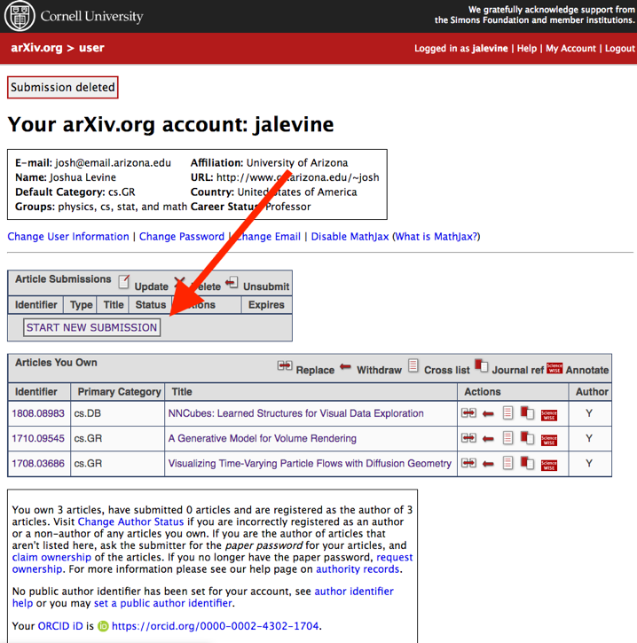
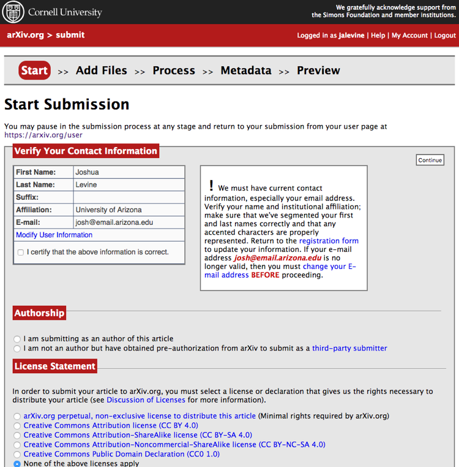
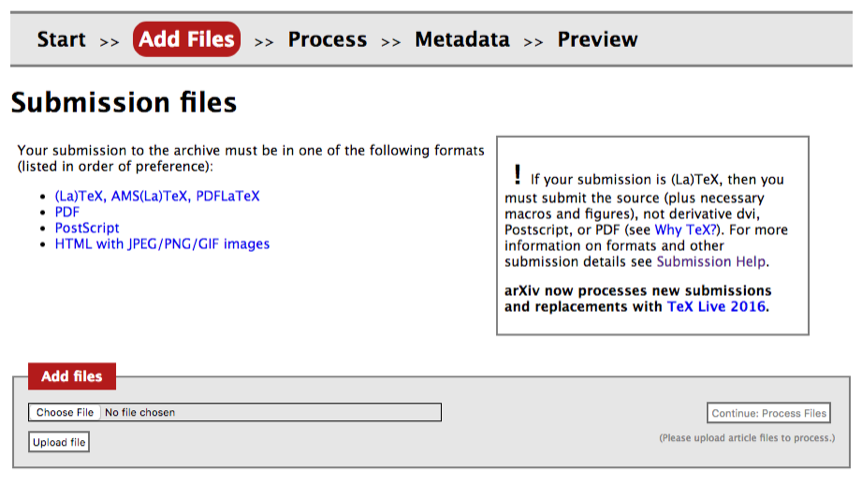

# How to share a paper via arXiv.org
*This section was written by Joshua Levine and further edited by the Open Practice chairs.*
 
Note that this document is just a summary, please see [https://arxiv.org/help/submit](https://arxiv.org/help/submit) for the complete information. For information about arXiv’s licensing requirements please see [https://arxiv.org/help/license](https://arxiv.org/help/license).

## 1.Register as an author
See: [https://arxiv.org/user/register](https://arxiv.org/user/register)
 
You will need:

- An email address, username and password
- Some personal information such as current affiliation and default categories you will submit to.

## 2.Create a new submission
After your account is created, you can view your current submissions and create new ones from
[https://arxiv.org/user/](https://arxiv.org/user/)

  

## 3.Complete the submission process
 
a) Choose a license (the default arXiv license is recommended by IEEE)
 
 
 
 
Note that you may need endorsement in a category if it is the first time you’ve submitted to arXiv.org, especially in this category.  See [https://arxiv.org/help/endorsement](https://arxiv.org/help/endorsement).
 
There is currently no category explicitly for visualization. Some categories to consider might be: *cs.HC: Human Computer Interaction, cs.GR: Graphics or cs.LG:Learning*, however, feel free to choose any other category that best fits your paper.
 
b) Upload the pdf in the correct format, or alternatively in (La)Tex (see **Note-1**)

 
 
c) Complete the metadata (title, abstract, authors)

 
 
d) After previewing, the system may need to process for a few minutes before you will have the option to submit it from the preview section.

## 4.Wait for Processing by arXiv     
After the submission is processed, keep an eye out for an email from arXiv.org that provides a unique identifier for the paper.  You can share this with your co-authors so that they can add it to their list of articles that they own.

## 5.Update arXiv record post publication 
Once your paper is processed for publication by IEEE (post final acceptance) and after you receive the DOI, you must post an IEEE copyright notice on your preprint. According to IEEE author FAQ, you can replace the preprint with either: 1) the full citation to the IEEE work with Digital Object Identifiers (DOI) or a link to the paper’s abstract in IEEE Xplore, or 2) the accepted version only (not the IEEE published version), including the IEEE copyright notice and full citation, with a link to the final, published paper in IEEE Xplore.

## Further guidance

### Note-1:
arXiv prefers articles to be submitted in `TeX/LaTeX` format for reasons of stability and portability. If you are submitting in this format, you will notice that arXiv has some expectations to make things work smoothly. The arXiv guidance on this is helpful: [https://arxiv.org/help/submit_tex](https://arxiv.org/help/submit_tex)

One step that needs pointing out here is the requirement to use `.bbl` files to include the references as arXiv do not run BibTeX. It's easy to produce the `.bbl` file though. Once you compile your paper in a TeX editor, the `.bbl` file should be in the directory as a bi-product, just include that in the files to be submitted to arXiv.

**Overleaf users:** If you are using Overleaf, the easiest way to prepare a submission is to use the "Submit" button on Overleaf and scroll down to arXiv, download a zip file with all the needed files for your paper and then click on the Submit buton that takes you directly to arXiv pages for a new submission.
